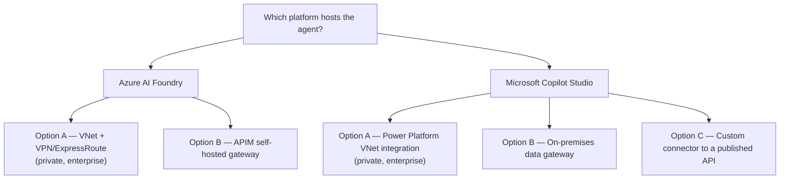
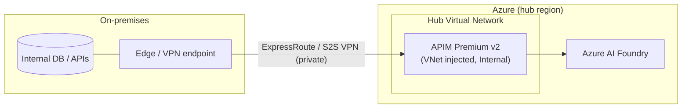
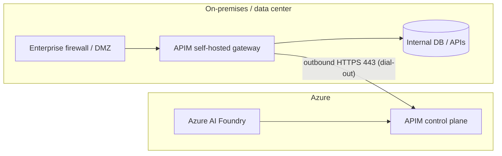
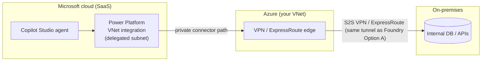
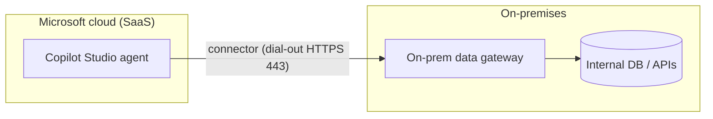
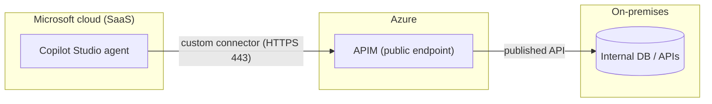

# AI Hybrid Data Sources

A recommended Azure reference architecture for connecting an **on-premises estate** to
cloud AI agents on **Azure AI Foundry** and **Microsoft Copilot Studio** — in both
directions, deployable with a single `azd up`.

It solves two problems at once, without exposing any private system to the public internet:

1. On-premises agents that need to **call Azure AI models**.
2. Cloud-hosted agents (Foundry or Copilot Studio) that need to **reach on-premises
   databases**.

> **What `azd up` deploys:** the **Foundry Option A** baseline — a hub VNet, a VpnGw1
> Site-to-Site VPN to your on-prem network, and **APIM Premium v2** VNet-injected in
> `Internal` mode. Copilot Studio **Option A** reuses the same tunnel. Every other option is
> documented here as guidance you layer on yourself.

## Contents

- [The core idea: two platforms, two directions](#the-core-idea-two-platforms-two-directions)
- [Azure AI Foundry](#azure-ai-foundry)
- [Microsoft Copilot Studio](#microsoft-copilot-studio)
- [Cost comparison](#cost-comparison)
- [Getting started](#getting-started)
- [Repository layout](#repository-layout)
- [Glossary](#glossary)
- [References](#references)

---

## The core idea: two platforms, two directions

Organize the choice by **which platform hosts the agent** — **Azure AI Foundry** or
**Microsoft Copilot Studio** — then pick a connectivity **option** under that platform.
Options are ordered **most-secure / most-enterprise first** (**Option A**), with
lighter-weight options after.

Two traffic directions apply across both platforms:

- **Egress** — on-prem agents calling Azure **models** (outbound only; the easy direction).
- **Ingress** — cloud-hosted agents reaching **on-prem data** (the hard direction — this is
  where the options differ).



One **Azure API Management (APIM)** control plane serves both platforms and both directions:
an AI Gateway for outbound model calls and a private ingress path to on-prem data.

### All options at a glance

| Platform | Option | Mechanism | Private-only data path | Access style | Deployed by this repo |
| --- | --- | --- | --- | --- | --- |
| **Foundry** | **A** | VNet + VPN/ExpressRoute; APIM Premium v2 injected | ✅ Yes | Raw private-IP / native protocol | ✅ Yes |
| **Foundry** | B | APIM self-hosted gateway (dial-out) | ❌ TLS over public internet | Governed APIs | — |
| **Copilot Studio** | **A** | Power Platform VNet integration → VPN/ExpressRoute | ✅ Yes | Connector over private path | Reuses the tunnel |
| **Copilot Studio** | B | On-premises data gateway + connectors | ❌ Dial-out via Microsoft cloud | Connectors / APIs | — |
| **Copilot Studio** | C | Custom connector → published (APIM) API | ❌ Public endpoint | APIs | — |

---

# Azure AI Foundry

Foundry-hosted agents run on **compute you configure**, so you can place the agent on your
own network (VNet injection, private endpoints). That makes a **fully private network path**
the default enterprise choice — hence it leads as **Option A** below.

## Egress — on-prem agents calling Azure models

For agents that **already run on-premises** (like your HR agents). They stay where they are,
read their data locally, and only reach **out** to Azure for model inference — a single
recommended pattern, with no option to choose.

- **Outbound HTTPS (443) only** to Azure Foundry / Azure OpenAI inference endpoints. No
  inbound connectivity and no VPN required.
- **Front model calls with APIM as an AI Gateway** — token-based rate limiting, semantic
  caching, cost attribution, and multi-model routing. Point the agent's model base URL at
  the APIM endpoint.
- **Authenticate with Microsoft Entra ID** (service principal or federated workload
  identity). No API keys stored in the on-prem app.
- **Telemetry & governance via the Agent 365 (A365) SDK** flow over the *same* outbound
  HTTPS 443 path — agents report telemetry and enroll for policy/governance to Azure/M365
  endpoints. This keeps the pattern identical: agent-initiated, outbound-only, no inbound.
- **Local data never leaves the premises** — only prompts, completions, and telemetry
  metadata transit to Azure.

---

## Ingress — Foundry agents reaching on-prem databases

For the **new agents you build in Foundry** that must reach back into private databases.
This is the harder direction, and the one where you choose an option.

### Choosing an option

> **Do you have a compliance or network mandate that private-data traffic must never
> traverse a public endpoint, or do agents need raw private-IP / native-protocol access?**

| | **Option A** — VNet + VPN/ExpressRoute | **Option B** — self-hosted gateway |
| --- | --- | --- |
| Private-only networking mandate | **Yes** | No |
| Typical fit | Regulated / high-assurance (finance, healthcare, gov); the enterprise default here | Teams without a private-only mandate |
| Access style | Raw **private-IP / network** access | Agents call **APIs** |
| Throughput | High / deterministic (ExpressRoute) | Standard |
| Relative cost | Higher (always-on gateway + Premium v2) | Lower (no VPN) |

This reference implementation **leads with Option A** as the enterprise-grade default — and
it's the option the Bicep here deploys. Choose **Option B** when you don't need a private
network path and prefer a lighter, API-only footprint.

### Option A — VNet + VPN / ExpressRoute (enterprise, private) ⭐ deployed by this repo

Use this when a mandate requires private-data traffic to stay off public endpoints, when
agents need raw private-IP access rather than API calls, or when you need deterministic high
throughput. You extend your network into Azure so services on a VNet have direct
line-of-sight to on-premises hosts by private IP.

- **Site-to-Site (S2S) IPsec VPN** — an IKEv2 tunnel to a route-based Azure **Virtual
  Network Gateway**. Fits smaller sites and labs.
- **ExpressRoute (private fiber)** — for production/high-throughput, deterministic links.
- **APIM Premium v2 injected into the VNet** (this repo deploys it in `Internal` mode) for
  native private networking plus the AI-gateway features (semantic caching, token rate
  limiting).

**Benefits**

- **Security & compliance:** the data path is **private end-to-end** — no public endpoint
  exposure. Satisfies regulatory mandates and lets you layer NSGs, private endpoints, and
  network segmentation.
- **Latency & performance:** ExpressRoute delivers deterministic, low-latency,
  high-throughput links backed by an SLA; even S2S VPN gives a stable dedicated tunnel.
- **Native access:** agents get raw private-IP / network reach — use native database
  protocols (SQL, etc.) directly, not just APIs.
- **Deterministic routing:** predictable hub-spoke routing tables for enterprise network
  integration.

**Trade-offs / issues**

- **Cost & complexity:** an always-on VPN gateway or ExpressRoute circuit **plus** a higher
  APIM tier (Premium v2), and more moving parts — VNet, gateway, routing, DNS, private
  endpoints — to design and operate.
- **VPN latency variability:** IPsec adds encryption overhead and still rides the public
  internet path; only ExpressRoute removes that variability (at higher cost and lead time).
- **Setup & lead time:** ExpressRoute provisioning can take weeks and needs a connectivity
  provider; VPN requires on-prem device configuration and key management.
- **Network-layer attack surface:** opening network reach (even private) demands careful
  segmentation and firewall/NSG rules; a misconfiguration has a larger blast radius than a
  single API gateway.
- **Ongoing operations:** manage gateway HA, tunnels, BGP/routing, and certificate/key
  rotation.



### Option B — APIM self-hosted gateway

Deploy the **APIM self-hosted gateway** as a container workload next to your data. It proxies
calls to internal databases while keeping them local, and Foundry reaches them through APIM —
the **same APIM instance** used for egress, so both directions share one control plane.

**Benefits**

- **Security:** no inbound firewall ports; databases are never exposed to the internet. The
  gateway is outbound-only over 443, with unified Entra ID auth and centrally managed policy.
- **Simplicity:** reuses existing on-prem hardware, no VPN gateway or VNet to design.
- **Governance & observability:** policies, keys, and config are pulled from Azure; metrics
  and logs flow back to a central monitoring workspace.
- **Portability:** runs on any Docker/Kubernetes host and isn't coupled to a network topology
  or region.

**Trade-offs / issues**

- **Latency:** the request path (Foundry agent → APIM → self-hosted gateway → DB) crosses the
  public internet over TLS, adding round-trip latency and jitter versus a private link.
- **Performance ceiling:** throughput is bounded by your gateway host sizing and internet
  egress bandwidth — there is no network SLA on the path.
- **API-only access:** you must expose databases as governed **APIs**. No raw SQL or
  private-IP/native-protocol access.
- **You operate the gateway:** run, patch, scale, and monitor the container (HA replicas).
- **Compliance fit:** the (encrypted) data path still traverses public internet, which may
  not satisfy strict private-only mandates — that's the trigger to use Option A.



---

# Microsoft Copilot Studio

Copilot Studio agents run in **Microsoft-managed SaaS (Power Platform)** — you **can't**
inject the agent into your VNet. On-prem reach therefore uses **Power Platform connectivity**
rather than the agent's own network stack. The directions are the same as Foundry, but the
mechanisms differ; options below are ordered **most-secure first**.

## Egress — models

Foundation models are **platform-managed**; govern usage with **Power Platform DLP**. To put
the APIM AI Gateway in front of custom or bring-your-own models, expose them through a
**custom connector**. There's no on-prem egress pattern here — a Copilot Studio agent never
runs on-premises.

## Ingress — Copilot Studio agents reaching on-prem data

### Option A — Power Platform VNet integration (enterprise, private)

A subnet-delegated **enterprise policy** routes connector traffic through a delegated subnet
in your VNet, which reaches on-prem privately over **VPN / ExpressRoute**. The agent stays
SaaS; only the **connector data path** becomes private — the closest Copilot Studio
equivalent to Foundry **Option A**, and it can ride the **same S2S tunnel this repo deploys**.

**Benefits**

- **Security & compliance:** no public endpoint for the data path; layer NSGs, private
  endpoints, and segmentation. Best fit for private-only mandates.
- **Reuses your network:** shares the VPN / ExpressRoute link and hub VNet already built for
  Foundry Option A.
- **Governance:** Power Platform DLP + connector governance + Purview + Agent 365.

**Trade-offs / issues**

- **Agent still SaaS:** the agent gets a private *connector* path, not raw private-IP reach —
  no native-protocol access from the agent itself.
- **Setup:** enterprise policy + subnet delegation to configure and operate.
- **Topology coupling:** tied to the Power Platform environment region and the hub VNet.
- **Cost:** always-on VPN gateway (and typically higher Power Platform / APIM tiers).



### Option B — On-premises data gateway (connector / API path)

Install the **on-premises data gateway** next to your data; connectors **dial out** to Power
Platform over 443. No inbound firewall ports — analogous to the Foundry self-hosted gateway,
but it's the Power Platform gateway driving connectors.

**Benefits**

- **No inbound ports:** databases are never exposed to the internet; the gateway is
  outbound-only.
- **Reuses on-prem hardware** and the broad Power Platform **connector catalog**; can also
  front the same APIM-published APIs.
- **Governance:** Power Platform DLP + connector governance.

**Trade-offs / issues**

- **Not a private-only path:** the (encrypted) data path transits the Microsoft cloud, so it
  may not satisfy strict private-only mandates — that's the trigger to use Option A.
- **You operate the gateway:** install, patch, and monitor it (with clustering for HA).
- **Connector / API-only:** no raw private-IP or native-protocol access.
- **Throughput:** bounded by the gateway host and its internet link.



### Option C — Custom connector to a published API (simplest)

Point a **custom connector** at an internet-reachable HTTPS API — for example an APIM-fronted
endpoint (or the APIM self-hosted gateway's published APIs).

**Benefits**

- **Simplest:** no gateway or VNet to run; stand up an API and connect.
- **Governed by APIM + DLP:** auth, rate limiting, and policy still apply at the gateway.

**Trade-offs / issues**

- **Public endpoint:** the API is reachable on the internet (protected by auth / APIM policy,
  but not network-isolated) — **not** for private-only mandates.
- **API-only:** no raw private-IP or native-protocol access.
- **You own the API surface:** design, auth, schema, and versioning.



---

## Cost comparison

Monthly estimates use **East US retail (USD)**, **730 hours/month**, pay-as-you-go rates.
They **exclude** data transfer and Azure AI Foundry **token consumption**, which are
usage-based and the **same regardless of option**. Indicative as of 2026-09 — confirm with
the [Azure pricing calculator](https://azure.microsoft.com/pricing/calculator/).

### Fixed component rates

| Component | SKU | Hourly | Monthly (~730h) |
| --- | --- | ---: | ---: |
| APIM (dev/test) | Developer | $0.0658 | ~$48 |
| APIM (production) | Standard v2 | $0.9589 | ~$700 |
| APIM (VNet-injected) | Premium v2 (per unit) | $1.9178 | ~$1,400 |
| APIM self-hosted gateway | per gateway | $0.3425 | ~$250 |
| VPN Gateway | VpnGw1 | $0.19 | ~$139 |
| VPN Gateway | VpnGw2 | $0.49 | ~$358 |
| S2S tunnel connection | any VpnGw | $0.015 | ~$11 |

### Total by ingress footprint

Costs group into two Azure networking footprints. **Option A** on either platform (Foundry
VNet+VPN, Copilot Power Platform VNet integration) maps to the **VNet + VPN** footprint;
**Foundry Option B** maps to the **self-hosted gateway** footprint. **Copilot Option B**
(on-prem data gateway) adds no Azure networking cost — the gateway runs on-prem and dials
out — and **Copilot Option C** is APIM-only.

| | **Self-hosted gateway** footprint | **VNet + VPN** footprint |
| --- | --- | --- |
| Maps to | Foundry Option B | Foundry Option A · Copilot Option A |
| APIM tier | Standard v2 (~$700) | Premium v2, 1 unit (~$1,400) |
| Gateway / connectivity | 1 self-hosted gateway (~$250) | VpnGw1 + 1 tunnel (~$150) |
| On-prem hardware | Existing servers ($0 Azure) | None |
| **Azure fixed subtotal** | **~$950 / month** | **~$1,550 / month** |
| AI usage | Token-based (same) | Token-based (same) |

- **Egress adds no fixed networking cost** — it reuses the same APIM instance; you pay only
  for model tokens.
- **Dev/test self-hosted footprint ≈ ~$300/month** using the APIM Developer tier (~$48) plus
  one self-hosted gateway (~$250) — note Developer has no SLA.
- **ExpressRoute** (a VNet+VPN alternative to S2S VPN) is priced separately: a metered
  circuit starts ~**$55/month** for 50 Mbps, unlimited plans reach the thousands, plus a
  connectivity-provider fee.
- **Copilot Option B** uses the Power Platform on-prem data gateway (no Azure gateway cost;
  licensed via Power Platform) plus whatever APIM tier you choose.
- Scaling out multiplies the variable pieces — each extra APIM unit or self-hosted gateway
  adds its full monthly rate.

---

## Getting started

### Prerequisites

- [Azure Developer CLI (`azd`)](https://learn.microsoft.com/azure/developer/azure-developer-cli/install-azd)
- [Azure CLI (`az`)](https://learn.microsoft.com/cli/azure/install-azure-cli)
- An Azure subscription with rights to create resource groups and the resources above
- For the **self-hosted gateway** option (Foundry Option B): a reachable container host
  (Docker or Kubernetes) on-premises

### Deploy

```bash
azd auth login          # authenticate
azd up                  # provision infrastructure + deploy the reference system
```

`azd up` prompts for an environment name, subscription, and region — plus the **IPsec
pre-shared key** and an **APIM publisher email** — then provisions the recommended baseline
(**Foundry Option A**: the VNet + S2S VPN path with **APIM Premium v2** VNet-injected).
Because Premium v2 is an always-on, higher-cost tier, tear the environment down when you're
not actively testing and re-run `azd up` when you need it:

```bash
azd down
```

---

## Repository layout

> Infrastructure-as-code assets live under `infra/`, with `azure.yaml` at the repository
> root driving `azd`. The deployed baseline provisions **Foundry Option A** — the VNet,
> VpnGw1 gateway, local gateway, and IPsec connection, **plus** an **APIM Premium v2**
> instance VNet-injected in `Internal` mode — the single control plane both platforms reuse
> (Copilot Option A rides the same tunnel). On-prem strongSwan config lives under `onprem/`
> — see [onprem/INSTALL-strongswan-openwrt-mx4300.md](onprem/INSTALL-strongswan-openwrt-mx4300.md)
> for the router-side tunnel setup.

---

## Glossary

| Term | Meaning |
| --- | --- |
| **APIM** | Azure API Management — the shared control plane / AI Gateway |
| **A365** | Agent 365 — telemetry & governance SDK for agents |
| **VNet injection** | Placing a service (e.g. APIM Premium v2) directly inside your virtual network |
| **S2S / IKEv2** | Site-to-Site IPsec VPN tunnel to Azure |
| **PSK** | Pre-shared key that authenticates the IPsec tunnel |
| **ExpressRoute** | Private fiber circuit into Azure (alternative to S2S VPN) |
| **NSG** | Network Security Group — subnet-level firewall rules |
| **DLP** | Data Loss Prevention — Power Platform governance policy |
| **Enterprise policy** | Power Platform resource binding an environment to a delegated subnet |

---

## References

- [Azure AI Foundry](https://learn.microsoft.com/azure/foundry/what-is-foundry)
- [APIM self-hosted gateway overview](https://learn.microsoft.com/azure/api-management/self-hosted-gateway-overview)
- [APIM Premium v2 VNet injection](https://learn.microsoft.com/azure/api-management/inject-vnet-v2)
- [API gateway in Azure API Management](https://learn.microsoft.com/azure/api-management/api-management-gateways-overview)
- [Create a Site-to-Site VPN connection (Azure portal)](https://learn.microsoft.com/azure/vpn-gateway/tutorial-site-to-site-portal)
- [Power Platform virtual network support](https://learn.microsoft.com/power-platform/admin/vnet-support-overview)
- [On-premises data gateway](https://learn.microsoft.com/data-integration/gateway/service-gateway-onprem)
