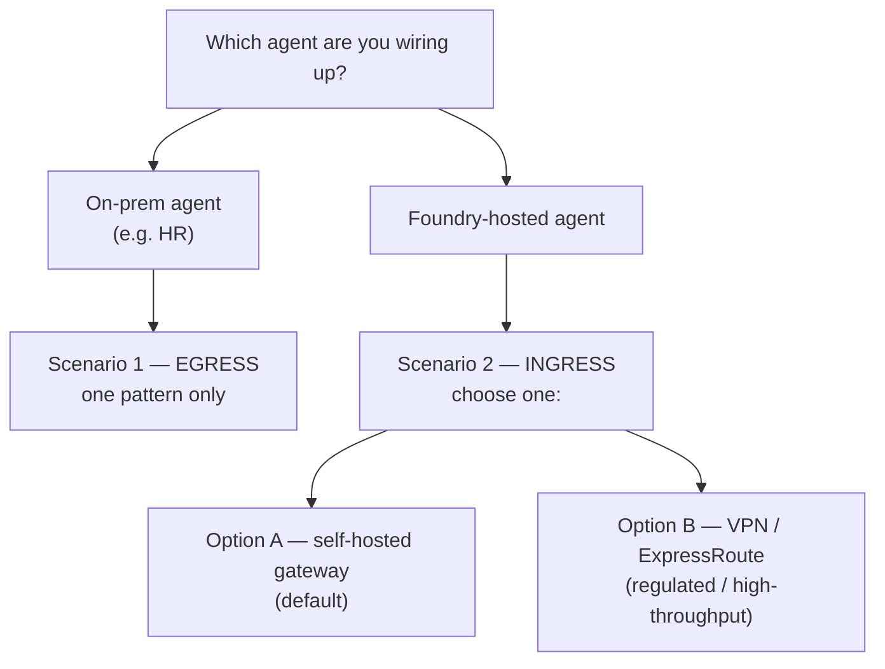
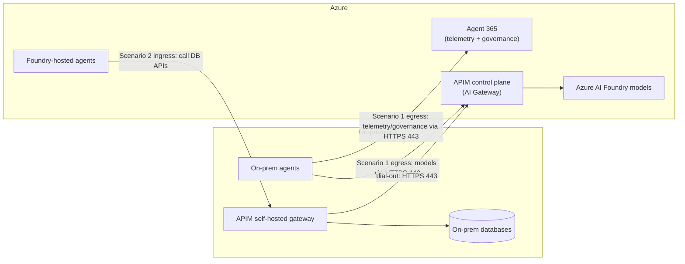
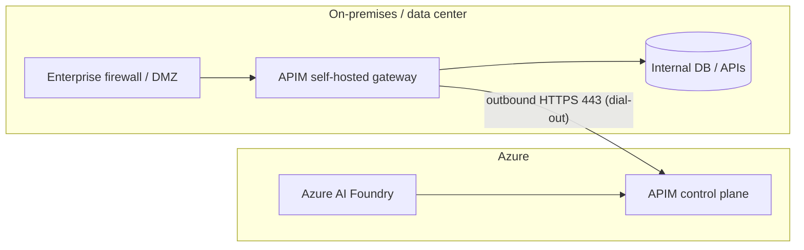
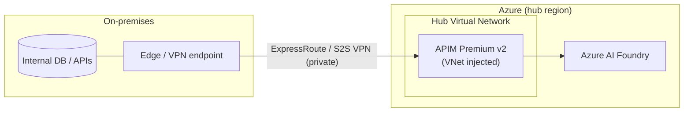

# AI Hybrid Data Sources

A recommended Azure reference architecture for connecting an **on-premises estate** to
**Azure AI Foundry** in both directions — deployable with a single `azd up`.

It solves two problems at once, without exposing any private system to the public internet:

1. On-premises agents that need to **call Azure AI models**.
2. Foundry-hosted agents that need to **reach on-premises databases**.

---

## The core idea: two agent types, two directions

Your estate has agents pointing in opposite directions. Each agent type uses **exactly one
direction** — you never build both for the same agent.

| | **On-prem agents** (e.g. HR) | **Foundry-hosted agents** |
| --- | --- | --- |
| Where it runs | On-premises | Azure AI Foundry |
| What it needs | Call Azure **models** | Reach **on-prem databases** |
| Direction | **Egress** (out to Azure) | **Ingress** (back to on-prem) |
| Options | One pattern (no choice) | **Option A or B** |
| Hard problem | None — data is already local | Exposing private data safely |



Both directions are served by **one Azure API Management (APIM) control plane**: an AI
Gateway for outbound model calls, and (for Option A) a self-hosted gateway at the edge for
inbound database calls — all over outbound HTTPS 443, with no inbound firewall ports.



---

## Scenario 1 — On-prem agents calling Azure models (egress)

For agents that **already run on-premises** (like your HR agents). They stay where they
are, read their data locally, and only reach **out** to Azure for model inference. There
is a single recommended pattern — **no Option A/B choice here**.

- **Outbound HTTPS (443) only** to Azure Foundry / Azure OpenAI inference endpoints. No
  inbound connectivity and no VPN required.
- **Front model calls with APIM as an AI Gateway** — token-based rate limiting, semantic
  caching, cost attribution, and multi-model routing. Point the agent's model base URL at
  the APIM endpoint.
- **Authenticate with Microsoft Entra ID** (service principal or federated workload
  identity). No API keys stored in the on-prem app.
- **Telemetry & governance via the Agent 365 (A365) SDK** flow over the *same* outbound
  HTTPS 443 path — agents report telemetry and enroll for policy/governance to Azure/M365
  endpoints. This adds outbound destinations to the egress allow-list but keeps the
  pattern identical: agent-initiated, outbound-only, no inbound. Model calls typically go
  through the APIM AI Gateway; A365 SDK traffic usually goes directly to its service
  endpoints.
- **Local data never leaves the premises** — only prompts, completions, and telemetry
  metadata transit to Azure.

---

## Scenario 2 — Foundry agents reaching on-prem databases (ingress)

For the **new agents you build in Foundry** that must reach back into private databases.
This is the harder direction, and the **only one with a choice** to make.

### Choosing A or B — one question

> **Do you have a compliance or network mandate that private-data traffic must never
> traverse a public endpoint?**

| | **Option A** — self-hosted gateway | **Option B** — VNet + VPN/ExpressRoute |
| --- | --- | --- |
| Private-only networking mandate | No | **Yes** |
| Typical fit | **Most organizations** | Regulated / high-assurance (finance, healthcare, gov) |
| Access style | Agents call **APIs** | Agents need raw **private-IP / network** access |
| Throughput | Standard | High / deterministic (ExpressRoute) |
| Relative cost | Lower (no VPN) | Higher (always-on gateway + higher APIM tier) |

**Rule of thumb:** start at **Option A**; move to **Option B** only if the mandate,
raw-network-access, or high-throughput rows apply. A being the default for most and B being
required for regulated shops are both true — they describe different populations, not a
contradiction.

### Option A — Self-hosted gateway at the edge (default)

Deploy the **APIM self-hosted gateway** as a container workload next to your data. It
proxies calls to internal databases while keeping them local, and Foundry reaches them
through APIM. It's the **same APIM instance** used for Scenario 1, so both directions share
one control plane.

**Benefits**

- **Security:** no inbound firewall ports; databases are never exposed to the internet.
  The gateway is outbound-only over 443, with unified Entra ID auth and centrally managed
  policy. Only the API responses you expose leave the building.
- **Simplicity:** reuses existing on-prem hardware, no VPN gateway or VNet to design, and
  one APIM control plane governs both egress and ingress.
- **Governance & observability:** policies, keys, and config are pulled from Azure;
  metrics and logs flow back to a central monitoring workspace.
- **Portability:** runs on any Docker/Kubernetes host and isn't coupled to a network
  topology or region.

**Trade-offs / issues**

- **Latency:** the request path (Foundry agent → APIM → self-hosted gateway → DB) crosses
  the public internet over TLS, adding round-trip latency and jitter versus a private
  link. Fine for typical API calls; less ideal for chatty or latency-critical workloads.
- **Performance ceiling:** throughput is bounded by your gateway host sizing and internet
  egress bandwidth — there is no network SLA on the path.
- **API-only access:** you must expose databases as governed **APIs** (design, auth,
  schema, versioning). No raw SQL or private-IP/native-protocol access.
- **You operate the gateway:** run, patch, scale, and monitor the container (HA replicas).
  If the on-prem host or its outbound internet link is down, ingress stops.
- **Control-plane dependency:** the gateway needs periodic outbound to APIM for config;
  during an extended disconnection it serves last-known config for a bounded window only.
- **Compliance fit:** the (encrypted) data path still traverses public internet, which may
  not satisfy strict private-only mandates — that's the trigger to move to Option B.



### Option B — Network connectivity via VPN / ExpressRoute (regulated / high-throughput)

Use this when a mandate requires private-data traffic to stay off public endpoints, when
agents need raw private-IP access rather than API calls, or when you need deterministic
high throughput. You extend your network into Azure so services on a VNet have direct
line-of-sight to on-premises hosts by private IP.

- **Site-to-Site (S2S) IPsec VPN** — an IKEv2 tunnel to a route-based Azure **Virtual
  Network Gateway**. Fits smaller sites and labs.
- **ExpressRoute (private fiber)** — for production/high-throughput, deterministic links.
- **Pair with APIM Premium v2 injected into the VNet** for native private networking plus
  the same AI-gateway features (semantic caching, token rate limiting).

**Benefits**

- **Security & compliance:** the data path is **private end-to-end** — no public endpoint
  exposure. Satisfies regulatory mandates and lets you layer NSGs, private endpoints, and
  network segmentation. Data never touches the public internet.
- **Latency & performance:** ExpressRoute delivers deterministic, low-latency,
  high-throughput links backed by an SLA; even S2S VPN gives a stable dedicated tunnel.
  Best fit for chatty, bulk, or latency-sensitive access.
- **Native access:** agents get raw private-IP / network reach — use native database
  protocols (SQL, etc.) directly, not just APIs.
- **Deterministic routing:** predictable hub-spoke routing tables for enterprise network
  integration.

**Trade-offs / issues**

- **Cost & complexity:** an always-on VPN gateway or ExpressRoute circuit **plus** a higher
  APIM tier (Premium v2), and more moving parts — VNet, gateway, routing, DNS, private
  endpoints — to design and operate.
- **VPN latency variability:** IPsec adds encryption overhead and still rides the public
  internet path; only ExpressRoute removes that variability (at higher cost and lead time).
- **Setup & lead time:** ExpressRoute provisioning can take weeks and needs a connectivity
  provider; VPN requires on-prem device configuration and key management.
- **Network-layer attack surface:** opening network reach (even private) demands careful
  segmentation and firewall/NSG rules; a misconfiguration has a larger blast radius than a
  single API gateway.
- **Ongoing operations:** manage gateway HA, tunnels, BGP/routing, and certificate/key
  rotation.
- **Topology coupling:** tied to the hub VNet's region and network design.



---

## Cost comparison

Monthly estimates use **East US retail (USD)**, **730 hours/month**, pay-as-you-go rates.
They **exclude** data transfer and Azure AI Foundry **token consumption**, which are
usage-based and the **same regardless of option**. Indicative as of 2026-09 — confirm with
the [Azure pricing calculator](https://azure.microsoft.com/pricing/calculator/).

### Fixed component rates

| Component | SKU | Hourly | Monthly (~730h) |
| --- | --- | ---: | ---: |
| APIM (dev/test) | Developer | $0.0658 | ~$48 |
| APIM (production) | Standard v2 | $0.9589 | ~$700 |
| APIM (VNet-injected) | Premium v2 (per unit) | $1.9178 | ~$1,400 |
| APIM self-hosted gateway | per gateway | $0.3425 | ~$250 |
| VPN Gateway | VpnGw1 | $0.19 | ~$139 |
| VPN Gateway | VpnGw2 | $0.49 | ~$358 |
| S2S tunnel connection | any VpnGw | $0.015 | ~$11 |

### Total by option (ingress path)

| | **Option A** — self-hosted gateway | **Option B** — VNet + VPN |
| --- | --- | --- |
| APIM tier | Standard v2 (~$700) | Premium v2, 1 unit (~$1,400) |
| Gateway / connectivity | 1 self-hosted gateway (~$250) | VpnGw1 + 1 tunnel (~$150) |
| On-prem hardware | Existing servers ($0 Azure) | None |
| **Azure fixed subtotal** | **~$950 / month** | **~$1,550 / month** |
| AI Foundry usage | Token-based (same) | Token-based (same) |

- **Egress (Scenario 1) adds no fixed networking cost** — it reuses the same APIM instance;
  you pay only for model tokens.
- **Dev/test Option A ≈ ~$300/month** using the APIM Developer tier (~$48) plus one
  self-hosted gateway (~$250) — note Developer has no SLA.
- **ExpressRoute** (Option B alternative to VPN) is priced separately: a metered circuit
  starts ~**$55/month** for 50 Mbps, unlimited plans reach the thousands, plus a
  connectivity-provider fee. Use it only when you need private, high-throughput links.
- Scaling out multiplies the variable pieces — each extra APIM unit or self-hosted gateway
  adds its full monthly rate.

---

## Getting started

### Prerequisites

- [Azure Developer CLI (`azd`)](https://learn.microsoft.com/azure/developer/azure-developer-cli/install-azd)
- [Azure CLI (`az`)](https://learn.microsoft.com/cli/azure/install-azure-cli)
- An Azure subscription with rights to create resource groups and the resources above
- For **Option A**: a reachable container host (Docker or Kubernetes) on-premises for the
  self-hosted gateway

### Deploy

```bash
azd auth login          # authenticate
azd up                  # provision infrastructure + deploy the reference system
```

`azd up` prompts for an environment name, subscription, and region, then provisions the
recommended baseline. Tear everything down with:

```bash
azd down
```

---

## Repository layout

> Infrastructure-as-code assets live under `infra/`, with `azure.yaml` at the repository
> root driving `azd`. This README documents the target architecture those assets deploy.

---

## References

- [Azure AI Foundry](https://learn.microsoft.com/azure/foundry/what-is-foundry)
- [APIM self-hosted gateway overview](https://learn.microsoft.com/azure/api-management/self-hosted-gateway-overview)
- [API gateway in Azure API Management](https://learn.microsoft.com/azure/api-management/api-management-gateways-overview)
- [Create a Site-to-Site VPN connection (Azure portal)](https://learn.microsoft.com/azure/vpn-gateway/tutorial-site-to-site-portal)
