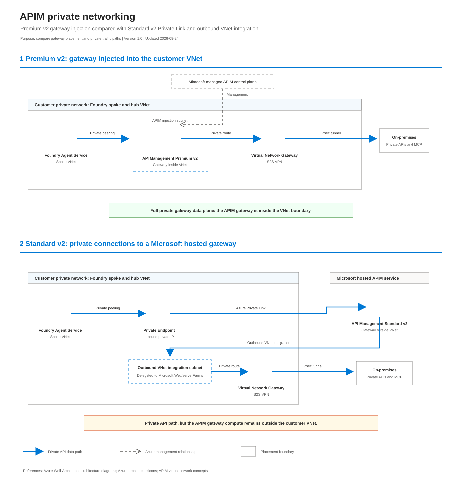

# APIM Premium v2 versus Standard v2 networking

The diagram compares the private gateway data path between Azure AI Foundry and
on-premises APIs over the Site-to-Site VPN. Select the image to open the editable
diagrams.net source.

## The key difference

**Premium v2** injects the APIM gateway data plane into a delegated subnet inside
the customer VNet. **Standard v2** remains a Microsoft-hosted service and uses two
network attachments: an inbound private endpoint and an outbound VNet integration
subnet.

Both designs can keep application API traffic private. Only Premium v2 provides
full gateway VNet injection.

## Capability comparison

| Capability | Premium v2 injection | Standard v2 with Private Link |
|---|---|---|
| Gateway placement | Injected into the hub VNet | Microsoft hosted outside the VNet |
| Private inbound API traffic | Directly to the injected private gateway | Through an inbound private endpoint |
| Public gateway exposure | No public gateway path in Internal mode | Disable public network access after creating the private endpoint |
| Private outbound API traffic | Directly through VNet routing | Through outbound VNet integration |
| On-premises reachability | VNet route to S2S VPN | Integration subnet route to S2S VPN |
| Inbound subnet | Dedicated injection subnet | Private endpoint subnet |
| Outbound subnet | Same injected APIM subnet | Separate dedicated integration subnet |
| Required delegation | `Microsoft.Web/hostingEnvironments` | `Microsoft.Web/serverFarms` on the integration subnet |
| Private DNS | Private record for the internal `azure-api.net` gateway | `privatelink.azure-api.net` for the private endpoint |
| Full gateway VNet injection | Yes | No |
| Private API data path possible | Yes | Yes, after Private Link, DNS, routing, and public-access configuration |
| Capacity pool | Premium v2 dedicated infrastructure | Standard v2 infrastructure |

## Privacy boundary

### Premium v2

- Foundry reaches a gateway that is physically injected into the private hub VNet.
- The gateway reaches on-premises APIs through private routing and the S2S VPN.
- Internal mode does not expose a public gateway path.
- Azure Resource Manager and APIM service management remain Microsoft-managed
  control-plane services.

### Standard v2

- Foundry reaches the hosted gateway through Azure Private Link.
- Public network access can be disabled only after the private endpoint is created.
- The hosted gateway reaches the hub through outbound VNet integration and then
  follows private routes to the S2S VPN.
- The private endpoint does not move the gateway into the VNet; it provides a
  private network interface to the hosted gateway.

## Editable source and export

- [Editable diagrams.net source](./network_diagram.drawio)
- [Rendered SVG](./network_diagram.svg)
- Export locally with:
  `./scripts/export-drawio.ps1 -InputPath network_diagram.drawio -OutputPath network_diagram.svg`

## Microsoft documentation

- [API Management virtual network concepts](https://learn.microsoft.com/azure/api-management/virtual-network-concepts)
- [Inject Premium v2 into a virtual network](https://learn.microsoft.com/azure/api-management/inject-vnet-v2)
- [Integrate Standard v2 for outbound private access](https://learn.microsoft.com/azure/api-management/integrate-vnet-outbound)
- [Connect to API Management with a private endpoint](https://learn.microsoft.com/azure/api-management/private-endpoint)
