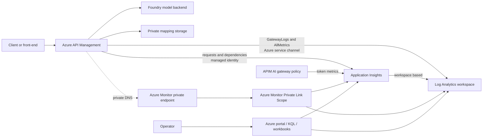

# Observability architecture and setup

This document describes the observability stack deployed by this repository for the hub
Azure API Management (APIM) service. For day-to-day investigation procedures and ready-to-use
queries, see the [observability user guide](./observability_user_guide.md).

## Scope

The stack observes requests that pass through APIM, including calls from the front-end proxy
to Foundry-hosted model backends. It provides:

- an unsampled record of APIM gateway traffic;
- sampled, W3C-correlated request and dependency spans;
- APIM platform metrics;
- LLM token metrics emitted by the APIM policy; and
- private telemetry ingestion through Azure Monitor Private Link.

It does **not** automatically instrument code running in the front-end App Service or inside a
backend. Those applications need their own OpenTelemetry or Application Insights
instrumentation if code-level traces, exceptions, logs, or user events are required. The
baseline is an APIM/gateway view of the application.

## Architecture



There are two distinct telemetry delivery paths:

1. **APIM diagnostic settings** send `GatewayLogs` and `AllMetrics` to Log Analytics over an
   Azure-managed service channel. Gateway records land in `ApiManagementGatewayLogs`; metrics
   land in `AzureMetrics`.
2. **The APIM Application Insights logger** sends request and dependency telemetry using the
   APIM system-assigned managed identity. Ingestion reaches Application Insights through the
   Azure Monitor private endpoint. Because Application Insights is workspace-based, the data
   is stored in the same Log Analytics workspace in `AppRequests` and `AppDependencies`.

The two paths are complementary, not duplicates. `ApiManagementGatewayLogs` is the
authoritative unsampled gateway record. Application Insights supplies transaction-oriented
views and dependency correlation, but successful requests can be sampled.

## Deployed resources

Resource names use the repository's `resourceToken` suffix:

| Resource | Name pattern | Purpose |
| --- | --- | --- |
| Log Analytics workspace | `law-<token>` | Central KQL store for gateway, metric, request, and dependency data |
| Application Insights | `appi-<token>` | APIM request/dependency correlation, investigation views, and custom token metrics |
| Azure Monitor Private Link Scope | `ampls-<token>` | Associates the workspace and Application Insights with private ingestion |
| Azure Monitor private endpoint | `pep-ampls-<token>` | Private IPs for Azure Monitor ingestion endpoints |
| Azure Monitor Workbook | `APIM Observability` | Operational dashboard for traffic, failures, latency, dependencies, governed usage, LLM telemetry, and platform health |
| Azure Monitor Workbook | `AI Gateway Usage Dimensions` | Focused Product ID, Subscription ID, Backend ID, Deployment, token consumption, and remaining-limit analysis |
| Azure Monitor Workbook | `AI Gateway Dimension Values` | One row per APIM request with request time, Product ID, Subscription ID, Backend ID, and Deployment |
| Private DNS zones | `privatelink.monitor.azure.com`, `privatelink.oms.opinsights.azure.com`, `privatelink.ods.opinsights.azure.com`, `privatelink.agentsvc.azure-automation.net`, and `privatelink.blob.core.windows.net` | Resolve Azure Monitor ingestion endpoints privately from the hub VNet |
| APIM Application Insights logger | `application-insights` | Sends APIM request and dependency telemetry |
| APIM diagnostic | `applicationinsights` | Controls sampling, correlation, verbosity, and captured fields |
| APIM diagnostic setting | `apim-gateway-logs` | Routes `GatewayLogs` and `AllMetrics` to the workspace |

The implementation is in
[`infra/apim-observability.bicep`](./infra/apim-observability.bicep), called from
[`infra/resources.bicep`](./infra/resources.bicep). The AI gateway token metric is defined in
[`peering/modules/apim-foundry-policy.xml`](./peering/modules/apim-foundry-policy.xml).

## Deployment outputs

After `azd up`, obtain the resource names without copying connection strings or keys:

```powershell
azd env get-value AZURE_RESOURCE_GROUP
azd env get-value APIM_NAME
azd env get-value LOG_ANALYTICS_WORKSPACE
azd env get-value APPLICATION_INSIGHTS_NAME
azd env get-value MONITOR_PRIVATE_LINK_SCOPE
azd env get-value MONITOR_PRIVATE_ENDPOINT_IP
azd env get-value OBSERVABILITY_WORKBOOK_ID
azd env get-value AI_GATEWAY_USAGE_WORKBOOK_ID
azd env get-value AI_GATEWAY_DIMENSION_VALUES_WORKBOOK_ID
```

The outputs are declared in [`infra/main.bicep`](./infra/main.bicep).

## Collection configuration

### Gateway logs

The APIM diagnostic setting enables:

- `GatewayLogs`, stored in `ApiManagementGatewayLogs`; and
- `AllMetrics`, stored in `AzureMetrics`.

`GatewayLlmLogs` is deliberately disabled because its schema can contain model request and
response messages. WebSocket, developer portal, and MCP logs are not part of this baseline.

Gateway logs are unsampled and include operational metadata such as:

- timestamp, request method, URL, API, operation, product, and subscription identifiers;
- frontend and backend status codes;
- total, backend, cache, and client timing;
- request and response sizes;
- backend identifier and URL;
- APIM policy error source, section, reason, and message; and
- a correlation ID.

### Application Insights

The APIM diagnostic produces:

- `AppRequests` for gateway requests; and
- `AppDependencies` for backend calls and policy dependencies such as Microsoft Entra ID and
  private mapping storage.

It uses W3C correlation, information verbosity, operation names, and `alwaysLog: allErrors`.
The default sampling percentage is 100%, configurable with
`apimTelemetrySamplingPercentage`. If sampling is lowered, errors remain captured but
successful requests may be represented by weighted `ItemCount` values.

The following response headers are retained as Application Insights request properties:

- `apim-request-id`
- `x-llmmgmt-model-ratelimit-limit`
- `x-llmmgmt-ratelimit-limit` (legacy alias for the model TPM limit)
- `x-llmmgmt-model-ratelimit-consumed`
- `x-llmmgmt-model-ratelimit-remaining`
- `x-llmmgmt-sku-ratelimit-limit`
- `x-llmmgmt-sku-ratelimit-consumed`
- `x-llmmgmt-sku-ratelimit-remaining`
- `x-llmmgmt-ratelimit-limit-calls`
- `x-llmmgmt-ratelimit-remaining-calls`
- `x-llmmgmt-retry-after`
- `x-llmmgmt-product-ratelimit-consumed`
- `x-llmmgmt-product-ratelimit-remaining`

The model and SKU limit headers are populated from the selected mapping entry's
`maxTokensPerMinute` and `skuGlobalMaxTokensPerMinute` values. The RPM limit comes from
`skuGlobalMaxCallsPerMinute`; when that property is absent, the policy preserves the legacy
20,000 calls-per-minute fallback. The model TPM and RPM counters are keyed by APIM
subscription plus deployment. The SKU TPM counter is keyed by APIM subscription. Together,
these headers support quota and throttling investigations without storing prompts or
responses.

### AI gateway token metrics

The APIM policy emits custom token metrics in the `AI-Gateway` namespace with these bounded
dimensions:

- Product ID
- Subscription ID
- Backend ID
- Deployment

Metrics can include total, prompt, completion, cached, reasoning, or other provider-specific
token categories. For streaming Chat Completions, callers must send
`stream_options.include_usage: true`; otherwise the final token usage event is unavailable or
an interrupted stream can produce an inaccurate count.

Azure Monitor custom metric cardinality limits apply. Do not add user IDs, request IDs,
prompt values, or other high-cardinality dimensions.

## Security and privacy posture

The baseline is intentionally metadata-only:

- Frontend and backend request and response body capture is fixed at zero bytes.
- Request headers are not captured.
- Only the six allow-listed response headers above are captured.
- Prompts, completions, authorization headers, subscription keys, mapping content, and
  managed-identity tokens are not logged.
- Application Insights and Log Analytics public ingestion are disabled.
- Query access remains public but requires Microsoft Entra authentication and Azure RBAC.
- Application Insights local authentication is disabled.
- APIM receives only the `Monitoring Metrics Publisher` role required to publish telemetry.
- The Log Analytics workspace defaults to 30 days of retention.

Operational metadata can still be sensitive. URLs identify model deployment names, caller IP
addresses may identify network locations, and product/subscription identifiers identify
consumers. Restrict query access and avoid exporting query results unnecessarily.

Recommended human access:

- use `Log Analytics Reader` at the workspace for investigators who only need logs;
- use `Monitoring Reader` when users also need metrics and monitoring configuration; and
- use a separate operational role for people who create alerts, workbooks, or diagnostic
  settings.

Do not grant broad Contributor access merely to run queries.

## Network behavior

The Azure Monitor Private Link Scope contains both the workspace and Application Insights.
Its access mode is:

- ingestion: `PrivateOnly`;
- query: `Open`.

The monitor private endpoint is placed in the hub private-endpoint subnet. A single AMPLS
private endpoint creates several IP addresses, so `MONITOR_PRIVATE_ENDPOINT_IP` is only the
first address. Private DNS records, not that one output, are authoritative.

APIM diagnostic settings use an Azure-managed delivery channel and do not depend on VNet DNS.
The Application Insights logger does depend on the private ingestion path and DNS zones.

## Parameters and cost controls

| Parameter | Default | Effect |
| --- | ---: | --- |
| `apimLogRetentionDays` | `30` | Workspace retention; allowed values are 30, 60, 90, 120, 180, 270, and 365 days |
| `apimTelemetrySamplingPercentage` | `100` | Percentage of successful APIM requests sent to Application Insights; errors are always logged |

The principal variable costs are Log Analytics ingestion and retention. Body capture is
disabled, which reduces both cost and data exposure. If volume grows:

1. Keep `GatewayLogs` enabled and unsampled for the authoritative operational record.
2. Lower Application Insights sampling for successful transactions if transaction views are
   too expensive.
3. Keep all-error logging enabled.
4. Review custom metric dimensions before adding any new values.
5. Use query time ranges and projected columns to avoid expensive interactive scans.

## Validation

### Portal

1. Open the APIM resource, then **Monitoring > Diagnostic settings**.
2. Confirm `apim-gateway-logs` sends `GatewayLogs` and `AllMetrics` to the expected workspace.
3. Open APIM **Application Insights** and confirm the `application-insights` logger is
   connected.
4. Open Application Insights **Logs** and run:

   ```kusto
   AppRequests
   | where TimeGenerated > ago(30m)
   | take 10
   ```

5. Open the Log Analytics workspace **Logs** and run:

   ```kusto
   ApiManagementGatewayLogs
   | where TimeGenerated > ago(30m)
   | take 10
   ```

6. Open the Azure Monitor Private Link Scope and confirm both scoped resources and the
   private endpoint connection are approved.

Allow several minutes after a test request for ingestion.

### Azure CLI

```powershell
$rg = azd env get-value AZURE_RESOURCE_GROUP
$apim = azd env get-value APIM_NAME
$workspace = azd env get-value LOG_ANALYTICS_WORKSPACE
$workspaceId = az monitor log-analytics workspace show `
  --resource-group $rg `
  --workspace-name $workspace `
  --query customerId -o tsv

az monitor log-analytics query `
  --workspace $workspaceId `
  --analytics-query "ApiManagementGatewayLogs | where TimeGenerated > ago(30m) | summarize Requests=count(), Failures=countif(IsRequestSuccess == false)" `
  --output table

az monitor log-analytics query `
  --workspace $workspaceId `
  --analytics-query "AppRequests | where TimeGenerated > ago(30m) | summarize Requests=sum(ItemCount), Failures=sumif(ItemCount, Success == false)" `
  --output table
```

An empty result is not necessarily a deployment failure: first send a request through APIM,
wait for ingestion, widen the time range, and verify the request reached the expected APIM
environment.

## Known boundaries

- The gateway stack cannot explain logic that happens entirely inside the front-end or
  backend process.
- `ApiManagementGatewayLogs` and `AppRequests` use different correlation fields. Join the
  gateway `CorrelationId` to the Application Insights request property `Request Id`, then use
  the Application Insights `OperationId` to find dependencies.
- `CallerIpAddress` can represent a proxy, VNet-integrated app, or NAT address rather than an
  end user.
- Successful Application Insights requests can be sampled; gateway logs are the source for
  exact traffic totals.
- Token metrics depend on a supported LLM response schema and available usage information.
- - This baseline provisions an Azure Monitor Workbook, but it does not provision alerts,
  action groups, Azure dashboards, or availability tests. The user guide explains how to
  operationalize the collected data.

## Microsoft references

- [Monitor Azure API Management](https://learn.microsoft.com/azure/api-management/monitor-api-management)
- [APIM monitoring data reference](https://learn.microsoft.com/azure/api-management/monitor-api-management-reference)
- [`ApiManagementGatewayLogs` table](https://learn.microsoft.com/azure/azure-monitor/reference/tables/apimanagementgatewaylogs)
- [`AppRequests` table](https://learn.microsoft.com/azure/azure-monitor/reference/tables/apprequests)
- [`AppDependencies` table](https://learn.microsoft.com/azure/azure-monitor/reference/tables/appdependencies)
- [`llm-emit-token-metric` policy](https://learn.microsoft.com/azure/api-management/llm-emit-token-metric-policy)
- [Application Insights failures, performance, and transactions](https://learn.microsoft.com/azure/azure-monitor/app/failures-performance-transactions)
- [Azure Monitor Workbooks](https://learn.microsoft.com/azure/azure-monitor/visualize/workbooks-overview)
