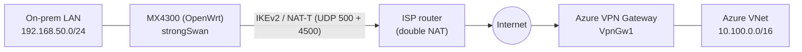

# Installing strongSwan on OpenWrt (Linksys MX4300) for the Azure S2S VPN

A step-by-step guide to turn a **freshly-flashed OpenWrt** Linksys MX4300 into the on-prem
IPsec endpoint for this repo's **Option B** Site-to-Site tunnel to the Azure VPN Gateway.

It pairs with the two config files already in this folder:

- [onprem/ipsec.conf](ipsec.conf) — the strongSwan connection (`conn azure`)
- [onprem/ipsec.secrets.example](ipsec.secrets.example) — the pre-shared-key template

> This guide assumes OpenWrt is **already installed** on the MX4300 and you can reach it.
> It does **not** cover flashing OpenWrt onto the stock Linksys firmware.

---

## 0. What you're building



### Values this guide uses (must match `ipsec.conf` and your Bicep deployment)

| Setting | Value | Source |
| --- | --- | --- |
| On-prem LAN (`leftsubnet`) | `192.168.50.0/24` | [ipsec.conf](ipsec.conf) |
| Azure VNet (`rightsubnet`) | `10.100.0.0/16` | [infra/resources.bicep](../infra/resources.bicep) |
| Azure gateway public IP (`right`) | `azd env get-value VPN_GATEWAY_PUBLIC_IP` | azd output |
| On-prem public IP / FQDN (`leftid`) | your ISP IP or DDNS FQDN | you |
| IKE proposal | `aes256-sha256-modp2048` | matches Azure custom policy |
| ESP proposal | `aes256-sha256` (no PFS) | matches Azure custom policy |
| Pre-shared key | the same value you gave the azd `sharedKey` prompt | you |

> **Double-NAT note:** the MX4300 typically sits **behind** an ISP router, so its WAN is a
> private address (e.g. `192.168.1.0/24`). That's fine — IKEv2 **NAT-T** (UDP 4500) tunnels
> through it. Because Azure needs your *public* identity, `leftid` is set to your public IP
> or DDNS FQDN, and the Bicep `localGateway` uses the same `onPremGatewayFqdn`/`onPremGatewayIp`.

---

## 1. Connect to the router

Default OpenWrt management address is `192.168.1.1`. SSH in as root:

```bash
ssh root@192.168.1.1
```

If you prefer the web UI (LuCI), browse to `http://192.168.1.1`. Every step below can be
done from the SSH shell.

Confirm the platform and free space before installing:

```bash
ubus call system board          # verify target is ipq807x / aarch64 (MX4300)
df -h /overlay                  # confirm you have room for the strongSwan packages
```

---

## 2. Set the LAN subnet to 192.168.50.0/24

The tunnel's `leftsubnet` is `192.168.50.0/24`, so the router's LAN must live there. A fresh
OpenWrt LAN is `192.168.1.1/24` — change it:

```bash
uci set network.lan.ipaddr='192.168.50.1'
uci set network.lan.netmask='255.255.255.0'
uci commit network
/etc/init.d/network restart
```

Your SSH session will drop. Reconnect at the new address:

```bash
ssh root@192.168.50.1
```

> Confirm the LAN subnet doesn't collide with your ISP router's LAN. If the upstream router
> also uses `192.168.50.0/24`, pick a different upstream range or LAN range so the two don't
> overlap (overlap breaks routing across the double NAT).

Make sure the router has working internet (WAN up) so it can pull packages:

```bash
ping -c 3 downloads.openwrt.org
```

---

## 3. Install strongSwan

Update the package index and install strongSwan with the OpenSSL crypto backend (fast AES
and DH on the MX4300):

```bash
opkg update
opkg install strongswan-default strongswan-mod-openssl
```

`strongswan-default` pulls in the charon daemon, the legacy `ipsec.conf`/`ipsec` tooling
(`stroke`/`starter`), the kernel-netlink interface, and the crypto modules this tunnel needs
(AES, SHA-256, and `modp2048` via GMP). `strongswan-mod-openssl` offloads the heavy math.

If a proposal ever fails to load with a "no matching algorithm" error, install the full set
instead:

```bash
opkg install strongswan-full
```

Verify the binary and modules are present:

```bash
ipsec version
ipsec listalgs | grep -iE 'aes256|sha256|modp2048'
```

---

## 4. Deploy the tunnel config

Copy the two files from this repo onto the router (via `scp` from your workstation, or paste
them with `vi`). Then fill in the placeholders.

### `/etc/ipsec.conf`

Start from [onprem/ipsec.conf](ipsec.conf) and replace the two placeholders:

```bash
# On your workstation, from the repo root:
scp onprem/ipsec.conf root@192.168.50.1:/etc/ipsec.conf
```

On the router, substitute the real values:

```bash
AZURE_IP="$(printf '%s' 'PASTE_VPN_GATEWAY_PUBLIC_IP')"
ONPREM_ID="$(printf '%s' 'PASTE_YOUR_PUBLIC_IP_OR_FQDN')"   # e.g. 69.123.141.164 or a DDNS FQDN
sed -i "s#<AZURE_VPN_GATEWAY_PUBLIC_IP>#${AZURE_IP}#g; s#<ONPREM_PUBLIC_IP_OR_FQDN>#${ONPREM_ID}#g" /etc/ipsec.conf
```

Get the Azure gateway IP from the deployment:

```bash
# On your workstation:
azd env get-value VPN_GATEWAY_PUBLIC_IP
```

### `/etc/ipsec.secrets`

Create it from [onprem/ipsec.secrets.example](ipsec.secrets.example), insert the **same PSK**
you gave the azd `sharedKey` prompt, and lock down the permissions:

```bash
cat > /etc/ipsec.secrets <<'EOF'
: PSK "REPLACE_WITH_SHARED_KEY"
EOF
sed -i 's#REPLACE_WITH_SHARED_KEY#your-actual-pre-shared-key#' /etc/ipsec.secrets
chmod 600 /etc/ipsec.secrets
```

> **Never commit the real `/etc/ipsec.secrets`.** The PSK must match the Azure connection's
> `sharedKey` exactly, or IKE_AUTH fails.

---

## 5. Firewall configuration

OpenWrt uses `fw4` (nftables). You need four things: let IKE/NAT-T/ESP **in** on WAN, allow
**forwarding** from the Azure subnet to the LAN, and **exclude tunnel traffic from NAT** so
the packets keep their `192.168.50.0/24` source (otherwise Azure's traffic selectors reject
them).

Append these sections to `/etc/config/firewall`:

```bash
cat >> /etc/config/firewall <<'EOF'

# --- Azure S2S VPN (strongSwan) ---

config rule
	option name 'Allow-IPsec-IKE'
	option src 'wan'
	option proto 'udp'
	option dest_port '500 4500'
	option target 'ACCEPT'

config rule
	option name 'Allow-IPsec-ESP'
	option src 'wan'
	option proto 'esp'
	option target 'ACCEPT'

config rule
	option name 'Allow-Azure-to-LAN'
	option src 'wan'
	option dest 'lan'
	option src_ip '10.100.0.0/16'
	option dest_ip '192.168.50.0/24'
	option target 'ACCEPT'

# Skip masquerade for tunnel traffic so the LAN source IP is preserved.
config nat
	option name 'No-NAT-to-Azure'
	option src 'wan'
	option proto 'all'
	option dest_ip '10.100.0.0/16'
	option target 'ACCEPT'
EOF

fw4 check          # validate the ruleset
/etc/init.d/firewall restart
```

> The default `lan → wan` forwarding rule already allows LAN hosts to reach `10.100.0.0/16`,
> so no extra outbound forwarding rule is needed — only the inbound `Allow-Azure-to-LAN` one.

---

## 6. Disable hardware/software flow offloading

The MX4300 (ipq807x) supports NAT flow offloading, which **bypasses the XFRM IPsec policies**
and silently breaks the tunnel's return path. Turn it off:

```bash
uci -q delete firewall.@defaults[0].flow_offloading
uci -q delete firewall.@defaults[0].flow_offloading_hw
uci set firewall.@defaults[0].flow_offloading='0'
uci commit firewall
/etc/init.d/firewall restart
```

---

## 7. Enable and start the service

```bash
/etc/init.d/ipsec enable        # start automatically on every boot
/etc/init.d/ipsec start
```

Because `conn azure` in [ipsec.conf](ipsec.conf) has `auto=start`, the tunnel initiates as
soon as the daemon comes up. To bring it up or down manually:

```bash
ipsec up azure
ipsec down azure
```

---

## 8. Verify the tunnel

```bash
ipsec statusall
```

Look for:

- `Security Associations (1 up, ...)` and `ESTABLISHED` for `azure`
- an installed **CHILD_SA** with your subnets: `192.168.50.0/24 === 10.100.0.0/16`

Confirm the encryption route exists (strongSwan installs it in table 220):

```bash
ip route show table 220
```

### End-to-end reachability

There's no test VM in this deployment. The `10.100.1.0/24` subnet now hosts the
VNet-injected **APIM Premium v2** gateway (`Internal` mode), which holds a private IP there.
APIM is a load-balanced service and may not answer ICMP, so the authoritative tunnel checks
are `ipsec statusall` (above) and the Azure connection status below.

On the Azure side, the connection status should show **Connected**:

```bash
# On your workstation:
az network vpn-connection show \
  --name "$(azd env get-value VPN_CONNECTION_NAME)" \
  --resource-group "$(azd env get-value AZURE_RESOURCE_GROUP)" \
  --query connectionStatus -o tsv
```

---

## 9. Troubleshooting

Turn up logging and watch the negotiation live:

```bash
logread -f &                     # follow the system log
ipsec restart
ipsec up azure
```

| Symptom | Likely cause | Fix |
| --- | --- | --- |
| Stuck in `CONNECTING`, no response from Azure | IKE/NAT-T blocked, or wrong `right` IP | Verify UDP 500/4500 rules (Step 5); confirm `VPN_GATEWAY_PUBLIC_IP`. |
| `IKE_AUTH failed` / `AUTHENTICATION_FAILED` | PSK mismatch | Re-check `/etc/ipsec.secrets` equals the azd `sharedKey`. |
| `NO_PROPOSAL_CHOSEN` | Crypto mismatch | Ensure `ike=aes256-sha256-modp2048!` and `esp=aes256-sha256!` — must match the Bicep `ipsecPolicies`. |
| `TS_UNACCEPTABLE` | Subnet/selector mismatch or NAT rewriting the source | Confirm `leftsubnet=192.168.50.0/24`, `rightsubnet=10.100.0.0/16`, and the **No-NAT-to-Azure** rule is active. |
| Tunnel `ESTABLISHED` but no traffic passes | Flow offloading still on, or return path filtered | Re-do Step 6; confirm the `Allow-Azure-to-LAN` forwarding rule. |
| Large transfers / TLS stall, small pings work | Path MTU / MSS over IPsec | Clamp MSS for the Azure subnet (below). |

### MSS clamping (fixes stalled large transfers)

IPsec lowers the effective MTU. Clamp TCP MSS for traffic to the Azure subnet:

```bash
cat >> /etc/config/firewall <<'EOF'

config rule
	option name 'Clamp-MSS-Azure'
	option src 'lan'
	option dest 'wan'
	option dest_ip '10.100.0.0/16'
	option proto 'tcp'
	option target 'ACCEPT'
	option extra '--tcp-flags SYN,RST SYN'
	option set_mark '0'
	option mtu_fix '1'
EOF
/etc/init.d/firewall restart
```

If `mtu_fix` on a rule isn't honored on your build, enable it on the WAN zone instead
(`uci set firewall.@zone[<wan-index>].mtu_fix='1'`).

---

## 10. Security checklist

- `/etc/ipsec.secrets` is `chmod 600` and **never committed** (already git-ignored).
- The PSK is long and random; rotate it by updating both the Azure `sharedKey` and this file.
- Only UDP 500/4500 and ESP are opened inbound on WAN — no other ports.
- Keep OpenWrt and strongSwan patched: `opkg update && opkg list-upgradable`.
- Consider a DDNS client (e.g. `luci-app-ddns`) if your ISP IP is dynamic, and set
  `onPremGatewayFqdn` in the Bicep so Azure tracks the changing address.

---

## Quick reference

```bash
ipsec statusall            # tunnel state + installed SAs
ipsec up azure             # bring the tunnel up
ipsec down azure           # tear it down
ipsec restart              # reload config and reconnect
ip route show table 220    # strongSwan's encryption routes
logread -f                 # live logs
fw4 check                  # validate firewall ruleset
```
