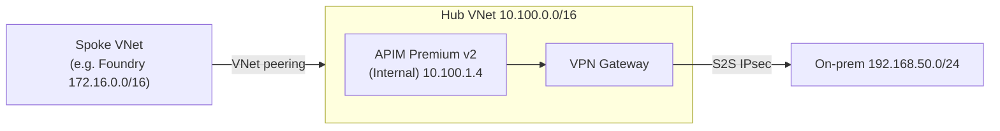

# VNet Peering — connecting services to the hub

How to peer another VNet (a "spoke") into this repo's **hub** VNet so services elsewhere
can privately reach the **APIM** control plane and, through it, **on-prem data** over the
Site-to-Site tunnel. Written for the deployed `dev1` environment; substitute your own
resource names/tokens as needed.

---

## Hub topology (what you're peering into)

| Component | Value |
| --- | --- |
| Hub VNet | `vnet-uisvrqjctoste` in `rg-dev1`, **Canada Central** |
| Hub address space | **`10.100.0.0/16`** |
| GatewaySubnet | `10.100.0.0/27` → **VpnGw1AZ** S2S tunnel to on-prem |
| APIM subnet | `10.100.1.0/24` — **APIM Premium v2 (Internal)**, private IP e.g. `10.100.1.4` |
| On-prem LAN (via tunnel) | **`192.168.50.0/24`** |



A peered spoke reaches **APIM in the hub** over plain peering. APIM then reaches on-prem over
its own tunnel — the spoke does **not** need direct on-prem access for the APIM path.

---

## Rules before you peer

1. **Non-overlapping address space.** The spoke must not overlap `10.100.0.0/16` (hub) **or**
   `192.168.50.0/24` (on-prem, reachable via the hub), or any reserved range.
2. **Region / peering type.** Same region as the hub (Canada Central) → **regional** peering.
   Different region → **global** peering (works; adds cross-region egress cost). APIM v2 uses a
   Standard load balancer, which is reachable over global peering.
3. **Foundry 10.x caveat.** The Foundry private-network template restricts `10.x` ranges to a
   specific region list that **excludes Canada Central** — so a Foundry spoke here must use
   **`172.16.0.0/16`** (or a `192.168.x` range that avoids `192.168.50.0/24`).

---

## Step 1 — Create the peering (both directions)

Peering is not transitive and must be created on **both** VNets.

```bash
HUB_RG=rg-dev1
HUB_VNET=vnet-uisvrqjctoste
SPOKE_RG=<spoke-rg>
SPOKE_VNET=<spoke-vnet>

# hub -> spoke
az network vnet peering create -g $HUB_RG --vnet-name $HUB_VNET -n hub-to-spoke \
  --remote-vnet $(az network vnet show -g $SPOKE_RG -n $SPOKE_VNET --query id -o tsv) \
  --allow-vnet-access

# spoke -> hub
az network vnet peering create -g $SPOKE_RG --vnet-name $SPOKE_VNET -n spoke-to-hub \
  --remote-vnet $(az network vnet show -g $HUB_RG -n $HUB_VNET --query id -o tsv) \
  --allow-vnet-access
```

Verify both show `peeringState: Connected`:
```bash
az network vnet peering list -g $HUB_RG --vnet-name $HUB_VNET -o table
```

---

## Step 2 — (Optional) Gateway transit, only if the spoke needs *direct* on-prem access

If a spoke service must reach **on-prem private IPs** (`192.168.50.0/24`) itself — not just call
APIM — let it use the hub's VPN gateway:

```bash
# hub side: allow the gateway to be shared
az network vnet peering update -g $HUB_RG --vnet-name $HUB_VNET -n hub-to-spoke \
  --set allowGatewayTransit=true
# spoke side: use the hub's gateway
az network vnet peering update -g $SPOKE_RG --vnet-name $SPOKE_VNET -n spoke-to-hub \
  --set useRemoteGateways=true
```

> **Not needed for the APIM path.** Foundry → APIM (both land in the hub over plain peering);
> APIM → on-prem is APIM's own path through the hub gateway.

---

## Step 3 — DNS so the spoke resolves APIM privately

Internal APIM has no public endpoint, so the spoke must resolve `…azure-api.net` to APIM's
**private** IP. Create/link a private DNS zone and point an A record at the current private IP:

```bash
# confirm APIM's current private IP first (Premium v2 assigns it dynamically)
#   from an on-prem/hub host: nmap -Pn -p443 --open 10.100.1.0/24   (finds the ASE front-end)
APIM_PRIVATE_IP=10.100.1.4

az network private-dns zone create -g $SPOKE_RG -n azure-api.net
az network private-dns record-set a add-record -g $SPOKE_RG -z azure-api.net \
  -n apim-uisvrqjctoste -a $APIM_PRIVATE_IP
az network private-dns link vnet create -g $SPOKE_RG -z azure-api.net \
  -n spoke-link --virtual-network $SPOKE_VNET --registration-enabled false
```

> Alternative: an Azure DNS Private Resolver if you centralize DNS. If APIM's private IP changes
> (it can, on Premium v2), update the A record.

---

## Step 4 — Verify from the spoke

From a resource in the spoke VNet:
```bash
nslookup apim-uisvrqjctoste.azure-api.net        # should resolve to the private IP
curl -sk https://apim-uisvrqjctoste.azure-api.net/onprem/json   # should return on-prem JSON
```

**NSG note:** no extra APIM inbound rule is needed — Azure's `VirtualNetwork` service tag
(used by APIM's default rules) **includes peered VNet address spaces**.

---

## Worked example — Foundry spoke

| Setting | Value |
| --- | --- |
| Spoke VNet | `172.16.0.0/16` (agent `172.16.0.0/24`, PE `172.16.1.0/24`), Canada Central |
| Peering | regional, both directions (Step 1) |
| Gateway transit | **not required** (agent calls APIM in the hub) |
| DNS | `azure-api.net` A record `apim-uisvrqjctoste` → `10.100.1.4`, linked to the spoke |
| Result | Foundry agent → peering → hub APIM → tunnel → on-prem container |

Non-overlap check: `172.16.0.0/16` vs hub `10.100.0.0/16` and on-prem `192.168.50.0/24` — clear.

---

## Teardown

```bash
az network vnet peering delete -g $HUB_RG --vnet-name $HUB_VNET -n hub-to-spoke
az network vnet peering delete -g $SPOKE_RG --vnet-name $SPOKE_VNET -n spoke-to-hub
# plus the private DNS link/zone if no longer needed
```
